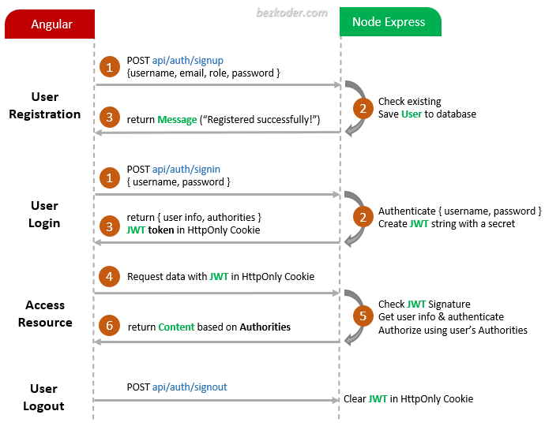

# MEAN stack Authentication and Authorization example

Build MEAN stack JWT Authentication & Authorization example with HttpOnly Cookie and JWT.

## Flow for User Registration and User Login

For JWT – Token based Authentication with Rest API, we’re gonna call 2 endpoints:

- POST `api/auth/signup` for User Registration
- POST `api/auth/signin` for User Login
- POST `api/auth/signout` for User Logout

You can take a look at following flow to have an overview of Requests and Responses:

## Run

### Node.js Server

Run `node server.js` for a dev server exporting API at http://localhost:8080/.

### Angular Client

Run `ng serve --port 8081`. Navigate to `http://localhost:8081/`.
